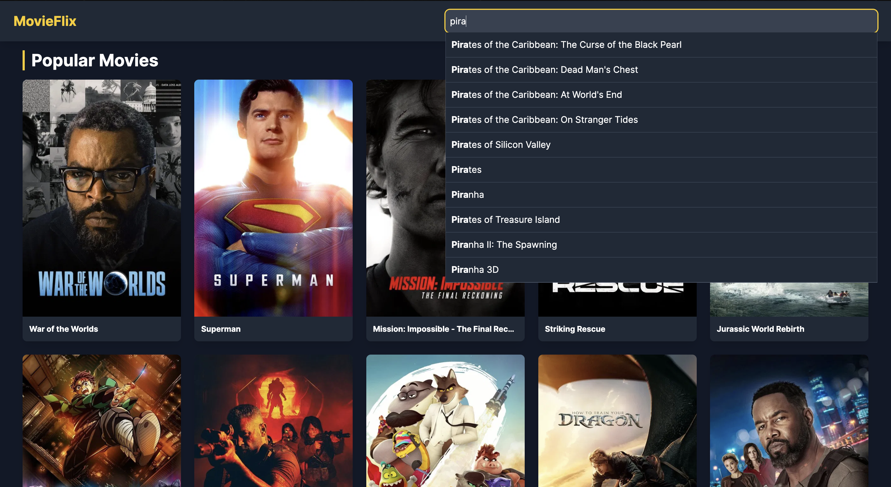
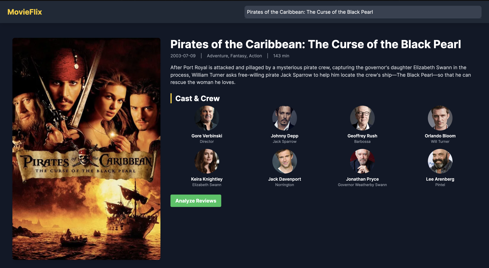
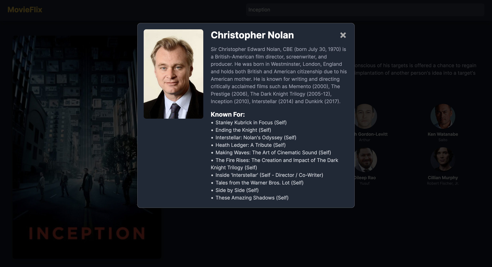

# MovieFlix: A Content-Based Movie Recommendation System

<p align="center">
  
  
  
  
  
</p>

---

### **▶️ Live Demo & Video**

**[► Open Live Website](https://movie-recommender-cvmp.onrender.com)**
> **Note:** This project is hosted on Render's free tier. As a result, the server will **spin down after a period of inactivity**. The initial load when you first visit the site might take up to **50 seconds** while the server wakes up. Subsequent requests will be fast.

**[► Watch the Demo Video](https://drive.google.com/file/d/1DnMOy8OIKMKCOihpwA_NqHYe7nRsSoll/view?usp=sharing)**


---

## **1. Project Overview**

MovieFlix is a comprehensive, full-stack movie recommendation web application designed to provide users with personalized, content-based movie suggestions. The project leverages a machine learning model built with Python and Scikit-learn, served via a robust Flask API. The frontend is a dynamic and responsive single-page application built with vanilla JavaScript that interacts with the backend to deliver a seamless user experience, enriched with live data from the TMDB API.

## **2. Key Features**

-   **Content-Based Recommendations:** The system uses a `CountVectorizer` and `cosine similarity` model to find and display 10 movies that are thematically and contextually similar to the user's search.
-   **Robust Two-Tiered Recommendation Logic:**
    -   **Tier 1 (Top 5):** The top 5 recommendations from the model are always displayed in order of similarity. If the TMDB API fails to fetch a poster, a stable placeholder is shown, ensuring the most relevant results are never skipped.
    -   **Tier 2 (Next 5):** The next 5 slots are backfilled with the first available movies from the rest of the model's prediction list, guaranteeing a full and visually complete set of 10 recommendations.
-   **Live Sentiment Analysis:** Users can click a button to open a dedicated page that fetches up to 25 recent user reviews from the TMDB API and performs real-time sentiment analysis using NLTK's VADER. The results include an overall percentage breakdown of positive, neutral, and negative feedback.
-   **Interactive UI & Rich Details:**
    -   **Autocomplete Search:** The search bar provides live suggestions from the movie corpus as the user types.
    -   
    -   **Comprehensive Movie Details:** The main view displays a wealth of information, including the poster, overview, genres, runtime, and crew information.
    -   
    -   **Clickable Actor/Crew Profiles:** Users can click on any cast member, director, or writer to open a detailed modal pop-up with their photo, biography, and a list of their most popular movies.
    -   


## **3. Workflow Explained**

The project follows a standard machine learning application workflow, from data processing to deployment.

1.  **Data Ingestion & Cleaning (Google Colab):** The process begins with a raw TMDB dataset of over 1.1 million movies. Using Pandas, this dataset is heavily filtered and cleaned (by vote count, language, date, etc.) to create a high-quality corpus of ~48,500 relevant films.
2.  **Feature Engineering:** A unified feature vector, or "tag," is engineered for each movie by combining key textual metadata, including its `overview`, `genres`, `cast` (top 5 actors), and `director`.
3.  **Model Building:** The text "tags" are converted into a 5,000-feature sparse matrix using Scikit-learn's `CountVectorizer`. This matrix, along with a processed movie list, is then serialized into `.pkl` files.
4.  **Backend API (Flask):** A Flask server is built with several API endpoints. The core `/api/recommend` endpoint loads the serialized model files, calculates the `cosine similarity` between the user's query and all other movies on-demand, and returns a list of the most similar movie IDs.
5.  **Frontend (JavaScript):** The vanilla JavaScript frontend handles all user interactions. It calls the Flask API to get recommendations and then makes further calls to the live TMDB API to enrich the results with posters, cast details, and other metadata before rendering the content on the page.
6.  **Deployment (Render):** The entire Flask application, including the model files, is deployed as a web service on Render, using Gunicorn as the production server.

## **4. Recommendation Examples**

Here are two examples of the recommendation engine in action.

#### **Recommendations for "Batman Begins"**


#### **Recommendations for "Pirates of the Caribbean"**


## **5. Folder Structure**

```text
MOVIE_RECOM_PROJ/
├── static/
│   ├── script.js
│   └── style.css
├── templates/
│   ├── index.html
│   └── sentiment.html
├── images/
│   ├── recs_1.jpg
│   └── recs_2.jpg
├── venv/
├── app.py
├── movies_processed.pkl
├── movie_vectors.pkl
├── requirements.txt
└── README.md
```

## **6. Tech Stack**

| Area          | Tools                                                              |
|---------------|--------------------------------------------------------------------|
| **Backend** | Python, Flask                                                      |
| **ML/NLP** | Pandas, NumPy, Scikit-learn (`CountVectorizer`, `cosine_similarity`) |
| **Sentiment** | NLTK (VADER)                                                       |
| **Frontend** | HTML, Tailwind CSS, Vanilla JavaScript                             |
| **APIs** | The Movie Database (TMDB) API                                      |
| **Deployment**| Gunicorn, Render                                                   |
| **Dev Tools** | Google Colab, Git, GitHub, VS Code                                 |

## **7. Future Enhancements**

-   **Hybrid Recommendation System:** Integrate collaborative filtering (user ratings) with the current content-based model for more personalized suggestions.
-   **Advanced Data Visualizations:** Add a dashboard to visualize data, such as word clouds of movie overviews or sentiment timelines for popular films.
-   **User Accounts & Watchlists:** Implement user authentication to allow for saved watchlists, ratings, and viewing history.
-   **Improved Search:** Integrate Elasticsearch to provide faster and more advanced fuzzy search capabilities.

## **8. About Me**

* **Saiyam Jain**
* **Connect with me:** [LinkedIn](https://www.linkedin.com/in/saiyam-jain-368a23294/) | [GitHub](https://github.com/saiyam-jain0)

## **9. License**

This project is licensed under the MIT License — feel free to use and modify.

## **10. Acknowledgments**

-   **TMDb API** for providing the comprehensive movie metadata and images that power this application.
-   The **NLTK** and **Scikit-learn** teams for their powerful and intuitive libraries.


